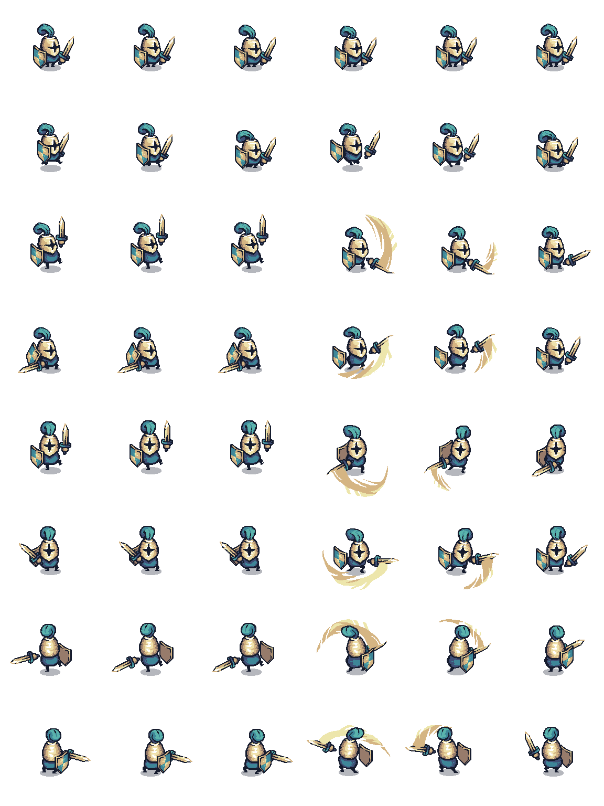

# 🗡️ GDC RPG Essentials Starter Kit

**语言：** [English](README.md) | 简体中文

这个仓库是一个基于 Tiny Swords 美术包的轻量级 Godot RPG 起步模板。

## 📦 资源授权说明

受资源包授权限制，本仓库仅包含标记为 CC0 的素材。

其余素材请从以下地址手动下载：

https://pixelfrog-assets.itch.io/tiny-swords

### 🔧 需要手动补充的素材

- Bushe1
- Bushe2
- Bushe3
- Tree3
- Tree4
- Water Foam
- Clouds_01
- Clouds_02
- Clouds_03
- Clouds_04
- Clouds_05
- Clouds_06
- Clouds_07
- Clouds_08
- Shadow
- Tilemap_color1
- Tilemap_color3
- Water Background color

## 🧙 当前玩家原型

项目目前已包含基础玩家场景与脚本。

- 场景: `res://scenes/entities/player/player.tscn`
- 脚本: `res://scenes/entities/player/player.gd`

### 🎮 操作说明

- 移动: `W/A/S/D` ⌨️
- 攻击: 鼠标左键 🖱️
